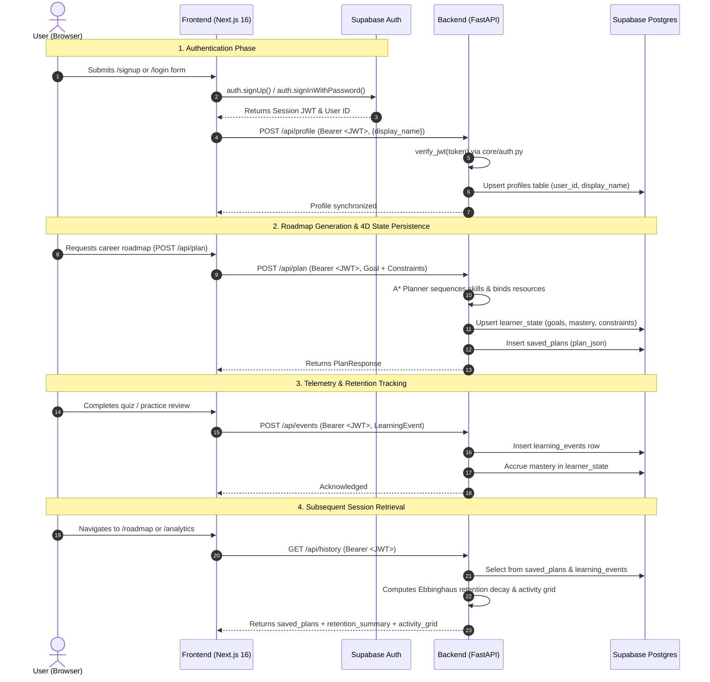

# Pathfinder — Supabase Auth & Persistence Setup Guide

This document outlines the setup procedure for Supabase Authentication and PostgreSQL persistence in the Pathfinder modular monolith.

---

## 1. Overview & Dual-Mode Behavior

Pathfinder is designed with a **strict graceful fallback** principle:
- **Unconfigured Mode (Default)**: If Supabase environment variables are unset or empty, Pathfinder runs locally as the `"demo"` learner using in-memory state. No errors or crashes occur.
- **Configured Mode**: When configured, Supabase Auth handles user identity, and Supabase PostgreSQL persists profiles, 4D learner states, learning events (telemetry/decay), and generated learning paths across sessions and restarts.

---

## 2. One-Time Database Migration

1. Log into your [Supabase Dashboard](https://supabase.com/dashboard) and navigate to your project.
2. Open the **SQL Editor** from the left navigation bar.
3. Copy the entire contents of [`backend/scripts/supabase_schema.sql`](file:///c:/HCL/My%20project/backend/scripts/supabase_schema.sql) and paste it into the editor.
4. Click **Run**.

The schema is completely idempotent (`CREATE TABLE IF NOT EXISTS`) and sets up:
- `profiles`: User display names and account metadata (`user_id uuid primary key`).
- `learner_state`: 4D learner model (`goal_text`, `target_role`, `constraints jsonb`, `mastery jsonb`).
- `learning_events`: Unified telemetry stream for quizzes, reviews, and Ebbinghaus retention decay.
- `saved_plans`: Generated roadmaps with milestones and resource bindings.
- Row Level Security (RLS) policies for user data isolation.

---

## 3. The 5 Required Environment Variables

### Frontend Configuration (`frontend/.env.local`)
Create or edit `frontend/.env.local`:

```env
# URL to your FastAPI backend
NEXT_PUBLIC_API_URL=http://localhost:8000

# 1. Supabase Project URL (Supabase Dashboard -> Settings -> API)
NEXT_PUBLIC_SUPABASE_URL=https://<your-project-id>.supabase.co

# 2. Supabase Anon/Public Key (Supabase Dashboard -> Settings -> API -> Project API keys -> anon public)
NEXT_PUBLIC_SUPABASE_ANON_KEY=eyJhbGciOiJIUzI1NiIsInR5cCI6IkpXVCJ9...
```

### Backend Configuration (`backend/.env`)
Create or edit `backend/.env`:

```env
# Application Settings
APP_NAME=Pathfinder
DEBUG=false

# 3. Supabase Project URL
SUPABASE_URL=https://<your-project-id>.supabase.co

# 4. Supabase Service Role Key (Supabase Dashboard -> Settings -> API -> Project API keys -> service_role secret)
# Note: Used over PostgREST (HTTPS) to bypass RLS securely from the trusted backend.
SUPABASE_SERVICE_KEY=eyJhbGciOiJIUzI1NiIsInR5cCI6IkpXVCJ9...

# 5. Supabase JWT Secret (Optional for legacy HS256; omit or leave empty for JWKS asymmetric verification)
SUPABASE_JWT_SECRET=your-supabase-jwt-secret-if-using-hs256

# CORS Origin
ALLOWED_ORIGINS=http://localhost:3000
```

---

## 4. Authentication Data Flow Diagram



---

## 5. Verification Checklist

Run from project root:
- **Backend Test Suite**:
  ```bash
  cd backend
  ./.venv/Scripts/python.exe -m pytest -v
  ```
- **Architecture Coupling Tests**:
  ```bash
  cd backend
  ./.venv/Scripts/python.exe -m pytest tests/test_architecture.py -v
  ```
- **Frontend Typecheck & Production Build**:
  ```bash
  cd frontend
  npm run build
  ```
